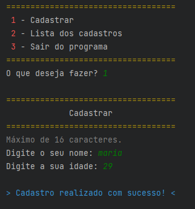
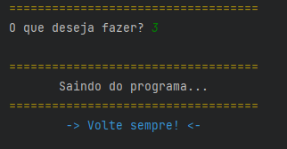

# Cadastro de Usuário
 
## Projeto final do Mundo 3 do curso de Python do site Curso em Vídeo

O programa permite cadastrar e listar o cadastro de pessoas.

Todo o cadastro fica salvo em um arquivo .txt, fazendo com que os dados fiquem salvos mesmo ao fechar o programa.

Contém todo o conhecimento adquirido durante a conclusão do curso: 

* básico da linguagem
* Utilização de módulos e bibliotecas
* Cores no terminal
* estrutura de decisão (If, Else, Elif)
* estruta de repetição (For e While)
* variáveis compostas (tuplas, listas e dicionários)
* Funções
* Modularização
* Tratamento de erros

## Funcionamento do programa:

Cria um menu em que o usuário escolhe uma das opções: cadastrar um novo usuário, listar todos os cadastros e sair do programa. Antes de executar uma das opções, o programa verifica se o arquivo 'cadastros.txt' está criado. Se não tiver, ele irá cria-lo.

Ao cadastrar, pergunta ao usuário o seu nome e idade e salva no arquivo 'cadastros.txt' (o nome tem limitação de 22 caracteres).

Ao listar, ele exibe em tabulação todos os cadastros, com o nome e idade das pessoas.

Ao sair, exibe uma mensagem de despedida, e finaliza o programa.

O programa fica em loop até o usuário querer sair.

<b>Em todas as ocasiões, contém tratamentos de erros</b>, caso o usuário digite valores inválido ou para corrigir excessões.

## Utilização do programa:

Faça download da pasta 'main' e execute o arquivo 'main.py' pelo intérprete do python.

**Obs: A pasta 'lib' precisa estar junto com o 'main.py'**

## Requisitos:

* Python 3.9 ou superior

